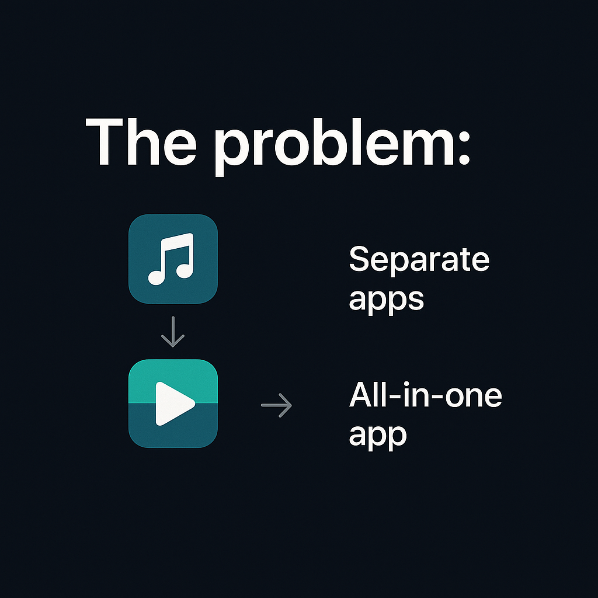
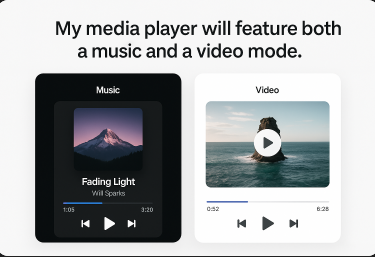
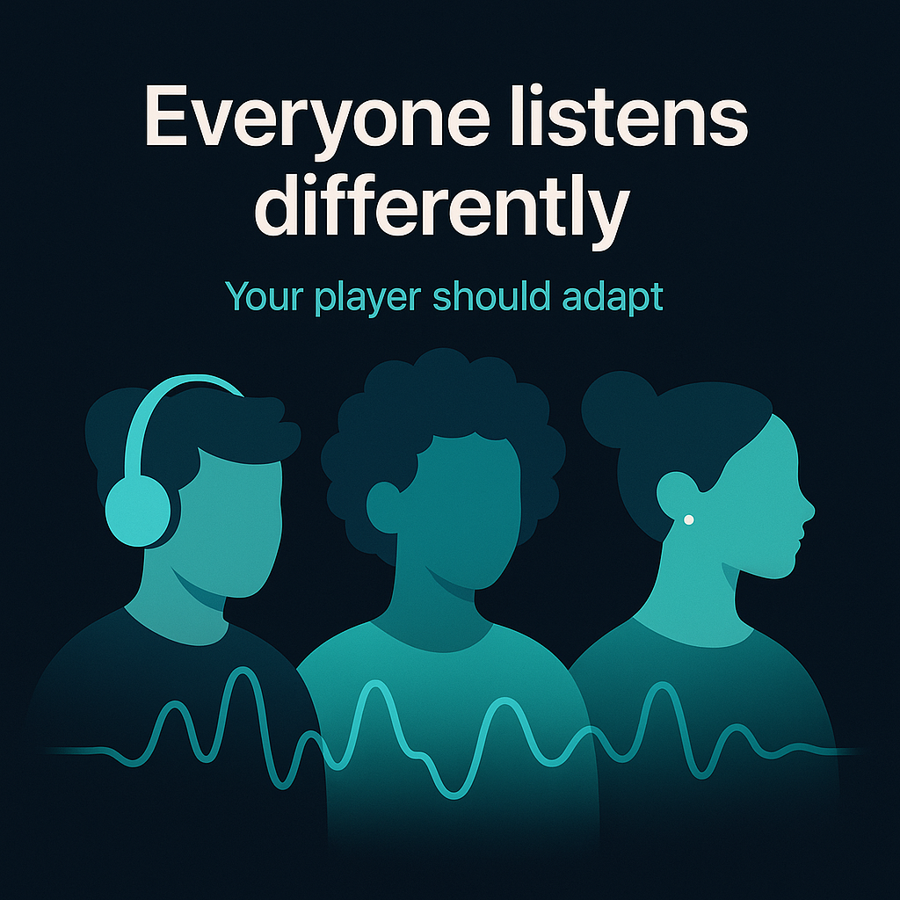
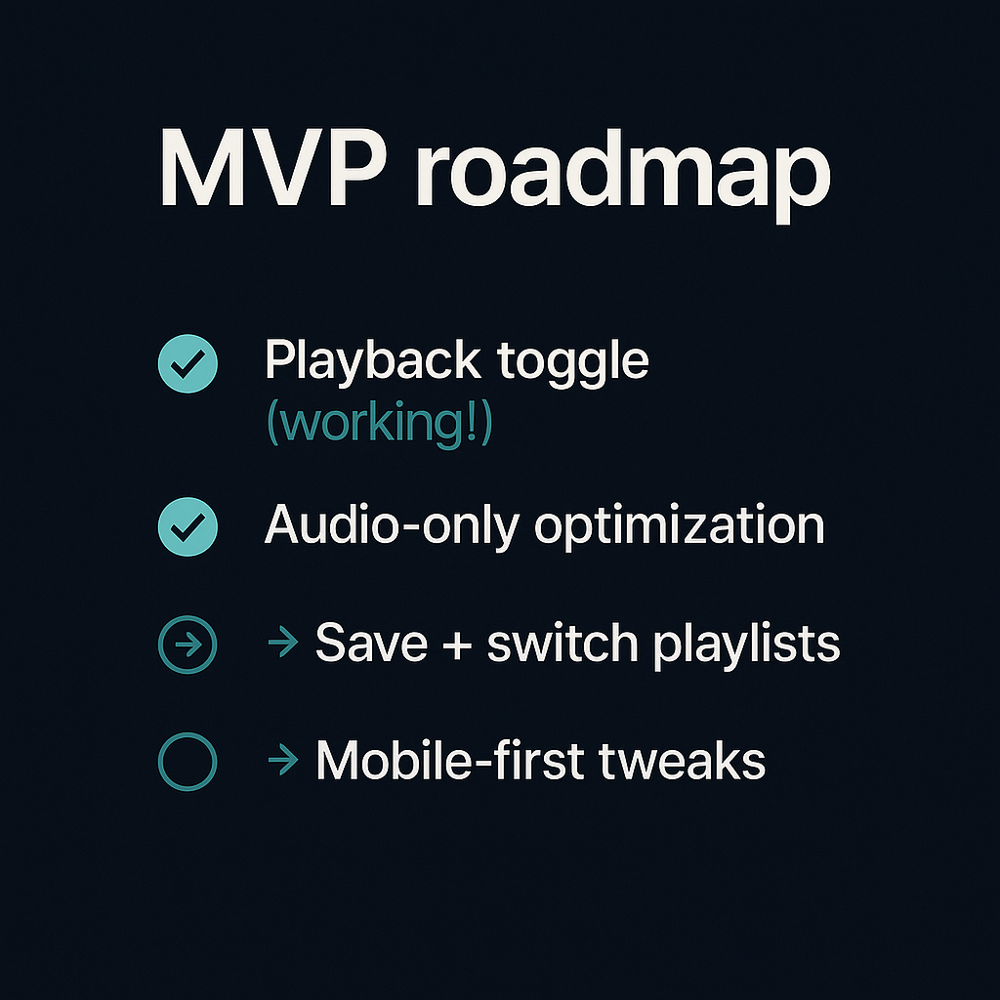

# 🎧 Reimagining the player: audio + video in one seamless flow

## Tweet 1 — Hook

> Most music apps do audio.  
> Most video platforms do video.  
>  
> What if your player let you **seamlessly switch between both** — with a single tap? 🎧🎥  
>  
> Here’s the idea behind the player I’m building 👇


---

## Tweet 2 — The Problem

> As users, we switch apps when we:  
> - Watch a music video  
> - Want to keep listening in the background  
> - Save it to a playlist  
>  
> Every switch breaks the flow.  
> Friction = drop-off.



---

## Tweet 3 — The Solution

> My player supports both modes:  
> ▶️ Video Mode: Watch with full UX  
> 🎧 Audio Mode: Strip visuals, continue playback  
>  
> Same track, one experience.  
> No restart. No switching.



---

## Tweet 4 — UI Design Focus

> The toggle is at the heart of the UI:  
> - One button to switch audio/video  
> - Keeps position, state, and volume  
>  
> Simple and fast. Built with React.


---

## Tweet 5 — Why it Matters

> ✨ Not everyone watches.  
> ✨ Not everyone listens.  
> ✨ But everyone values flow.  
>  
> The player adapts to *you* — not the other way around.



---

## Tweet 6 — What’s Next

> MVP roadmap:  
> ✅ Playback toggle (working!)  
> ✅ Audio-only optimization  
> 🔜 Save + switch playlists  
> 🔜 Mobile-first tweaks



---

## Tweet 7 — Call to Action

> Would *you* use a player that switches between video & audio?  
>  
> 💬 Drop your thoughts  
> ❤️ Like if it sounds useful  
> 🔁 RT if you want to see it built  
>  
> Follow [@minyorange](https://x.com/minyorange) to watch it come to life 🚀

---

## 📌 Hashtags

```text
#buildinpublic #SaaS #MusicTech #ReactJS #UXDesign
